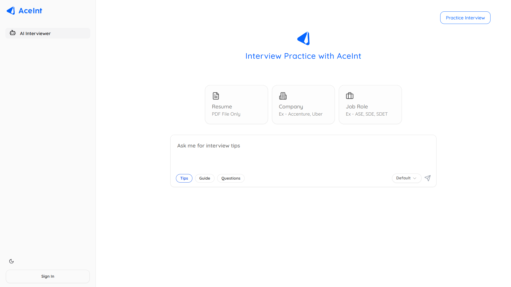
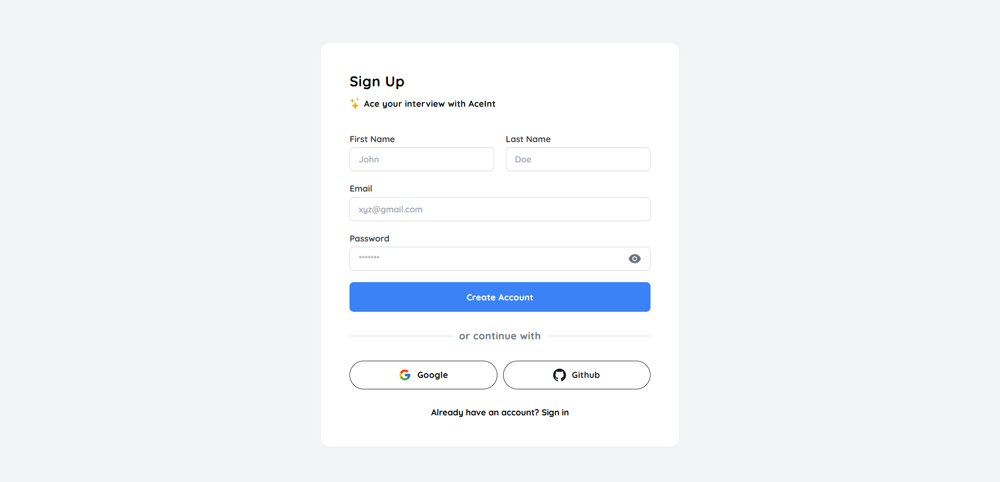
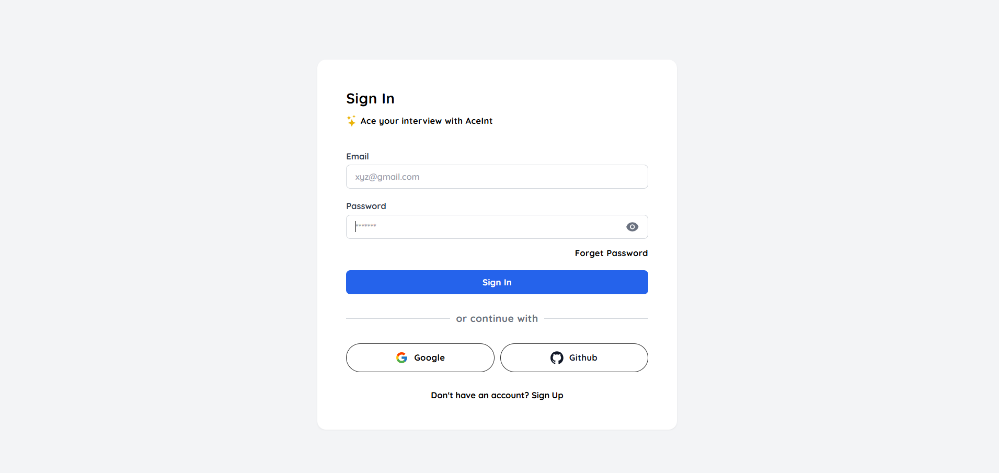
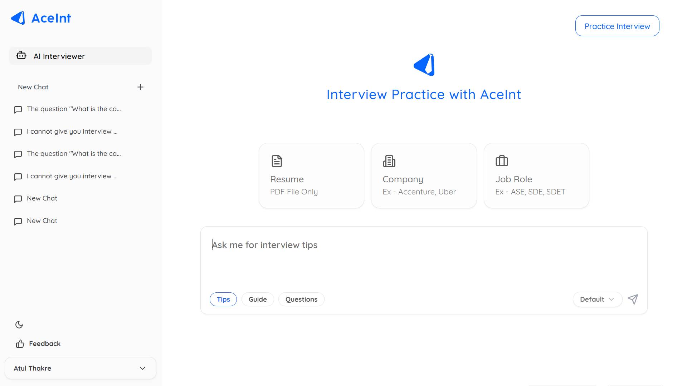
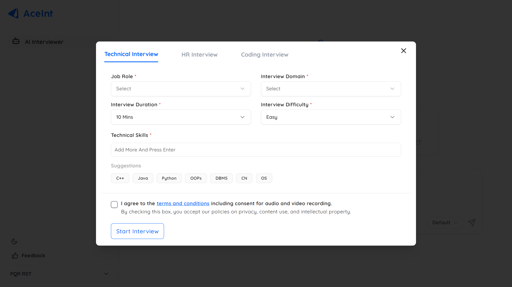
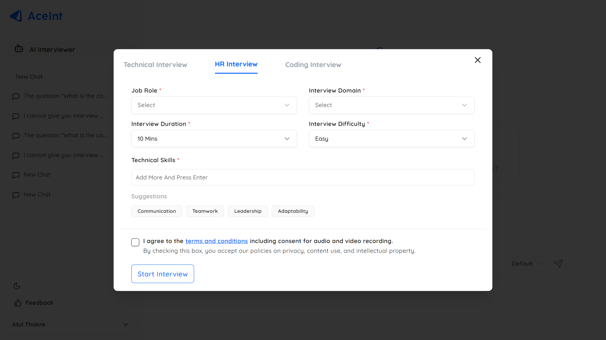
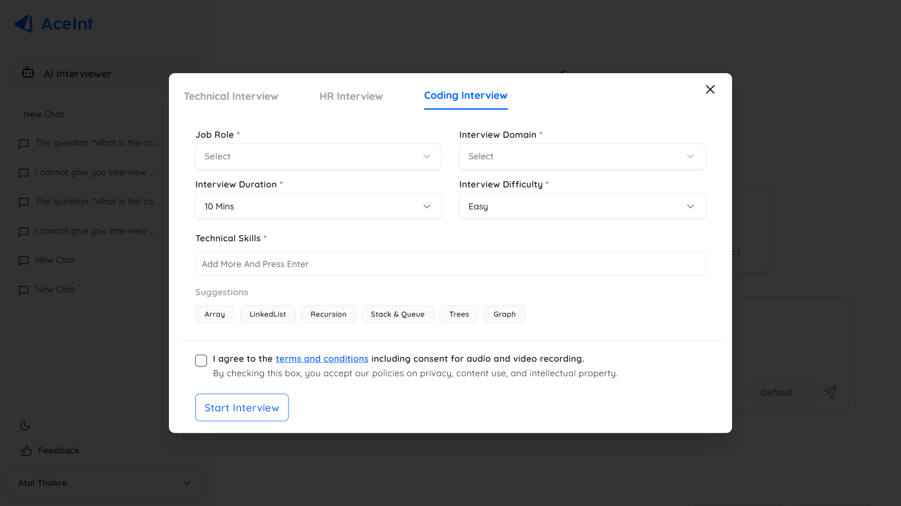
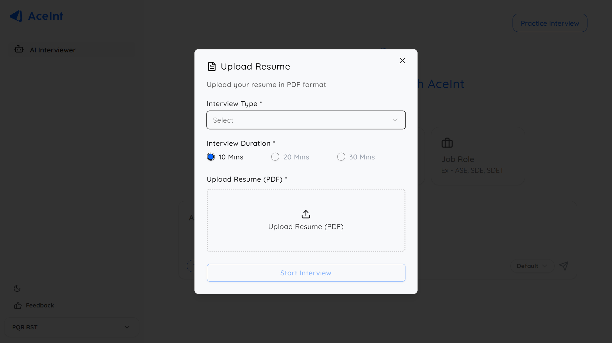
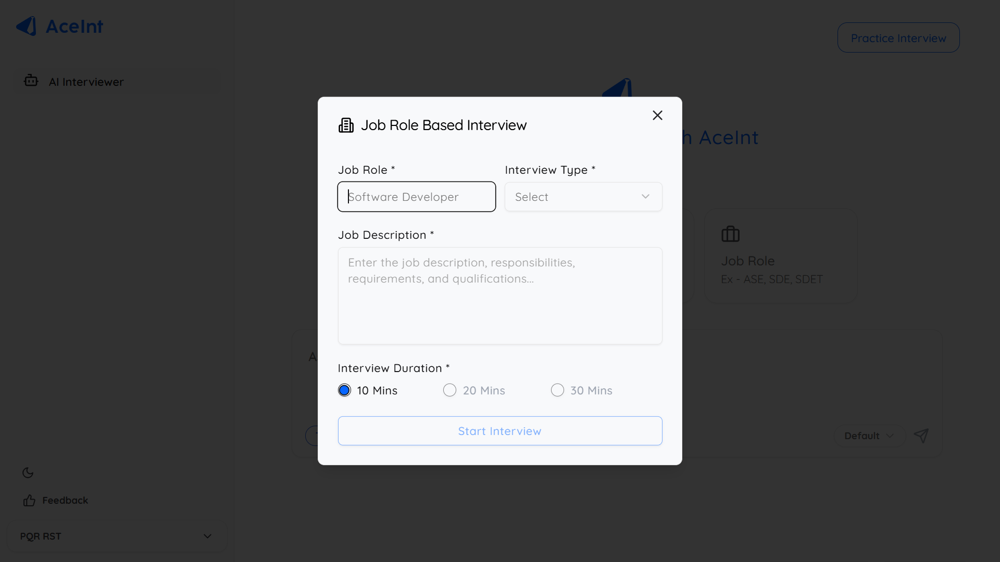
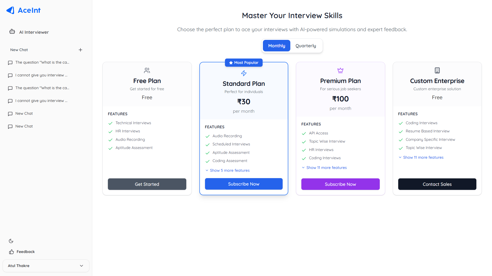

# 🚀 AceInt – AI Interview & Test Platform

AceInt is your personal interview buddy. Practice Ai interviews, take mock tests, and optimize your resume – all in one place.

---

## 📑 Table of Contents

1. [Getting Started](#getting-started)
2. [Signup & Login](#signup--login)
3. [Interviews (Practice Interview, Resume Base Interview, Company Base Interview, Job Role, etc.)](#mock-interviews)
4. [Pricing Plans](#pricing-plans)
5. [FAQs](#faqs)

---

## 🟢 Getting Started

Go to [AceInt.ai](https://aceint.ai) and register an account.

---

## 🔐 Signup & Signin

### Signup Steps:
1. Click on Sign Up.
2. Fill in the required details.
   First Name, Last Name, Email, Password
3. Or login with Google/GitHub.

### Signin Page:

1. Add Email & Password
2. Click on Login button

## Home Page

## 🎙️ Interviews

Steps to start an AI-powered interview:
1. Select Job Role
2. Interview Domain
3. Interview Duration
4. Interview Difficulty 
5. Technical Skill (If there is no technical skill in the suggestions, write and enter the skill manually)
6. Click **Start Interview**
7. Get real-time feedback

***Technical Interview***

***HR Interview***

***Coding Interview***

## 🎙️Resume Base Interviews

Step to Start Resume Base Inetrview
1. Select Interview Type
2. Select Interview Duration
3. Upload Your Resume (Only PDF File)
4. Click on Start Interview Button

## 🎙️Company Base Interviews

Step to Start Company Base Inetrview
1. Enter Company Name 
2. Select Interview Domain
3. Select Interview Type
4. Select Interview Duration
5. Upload Your Resume (Only PDF File)
6. Click on Start Interview Button

## 🎙️Job Role Base Interviews

Step to Start Job role Base Inetrview
1. Enter Job Role (Software Engineer, Java Developer, Software Developer) 
2. Select Interview Domain
3. Write the job description
4. Select Interview Duration
5. Click on Start Interview Button

## 💰 Pricing Plans

| Plan          | Features                         | Price        |
|---------------|----------------------------------|--------------|
| Free Plan     | Limited Test Access              | ₹0/month     |
| Standard Plan | Unlimited Tests + Dashboard      | ₹499/month   |
| Premium Plan  | All Features + AI Interview      | ₹999/month   |
| Custom Plan   |                                  |              |

---

## ❓FAQs

**Q:** Is it beginner friendly?  
**A:** Yes! No prior experience needed.

**Q:**
